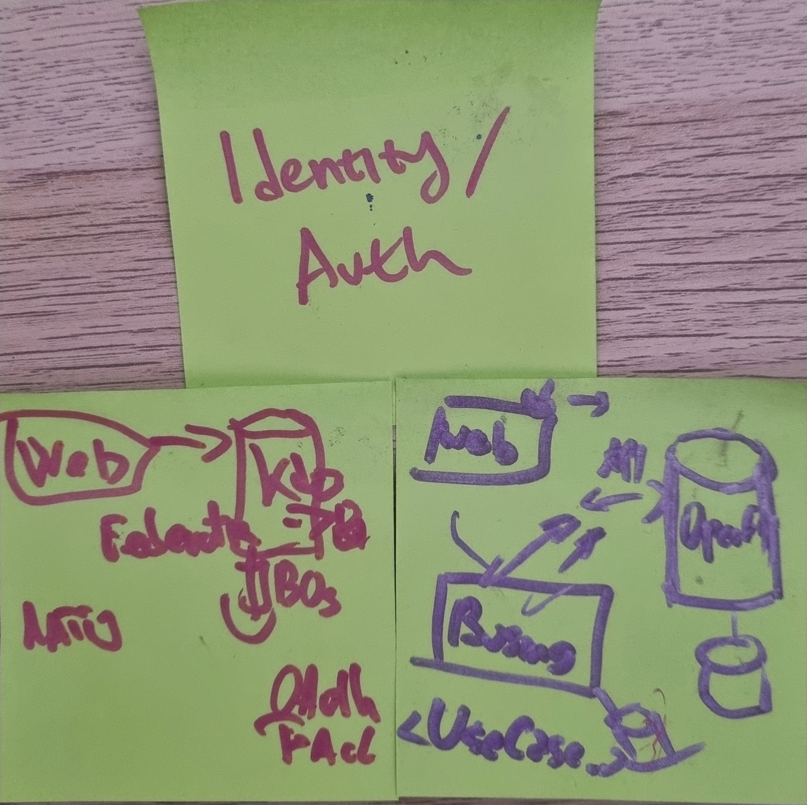
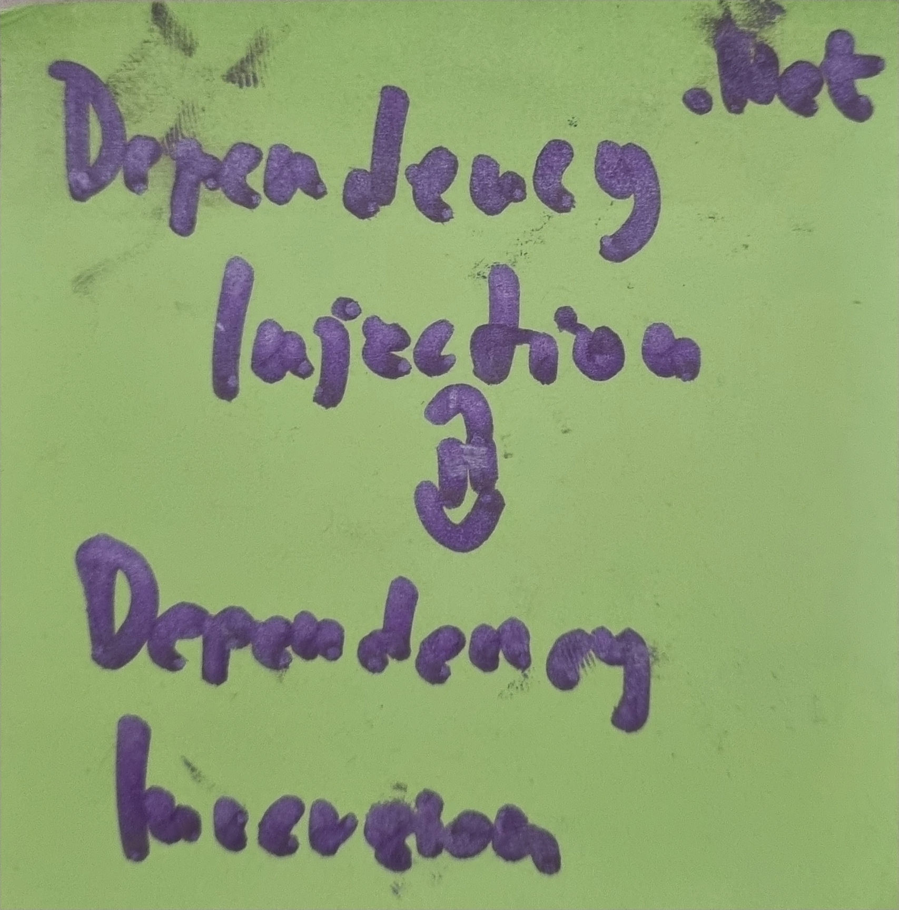
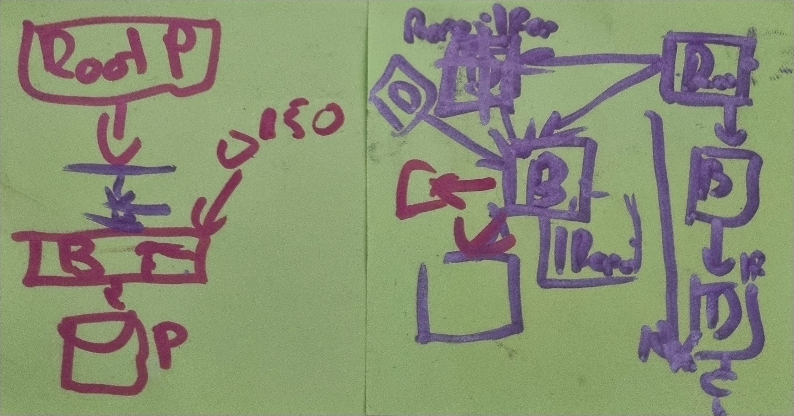

# Meet #1

## Participants
[Aleksa](https://github.com/alexakocic)
[Matija](https://github.com/MatijaMitic)
[Strahinja]

## Location
[Komuna Gastro](http://www.komunagastrobar.rs/)

## Topics

### Client/Server Autogenerated REST Interfaces

We talked about [Swagger](https://swagger.io/) and [OpenAPI](https://swagger.io/resources/open-api/) generators and how those can be applied in building pipelines. Is it a good practice to commit generated classes or to generate them each time before compliling? How those tools make life easier and when to work with [mustache](https://openapi-generator.tech/docs/templating/) adjustments? What are the most common options used when configuring [generators](https://openapi-generator.tech/docs/generators/csharp/) and which http libraries are used for generated clients?

### Identity / Auth

What are the most common services or platforms used for Authentication and Authorization? What is the current state of Microsoft Identity Server and what's the integrated dotnet solution for it? What happened with Auth0 and what was the replacement? We tackled complex examples where Authroization has to follow tree structure of defined access rights. How to synchronize such system with the changes in tree structure or where to place the authorization validation when protecting service? Is the ACL part of Authorization at all? How the mediator helps here?
We also covered alternative aproach with [Keycloak](https://www.keycloak.org/) and trade-offs between presented solutions.

### Dependency injection / Dependency inversion

How one can improve compile time using DI? If one project relay on dependency which is changed a lot, the project will be recompiled each time the dependency has changed. How the references can be set to optimize this? What might be the drawbacks? 

### OOM Exeception in Kubernetes pod

We covered an interesting businnes case where the pod does heavy computing with a lot of in-memory data. Sometimes the 40GB allocated memory might not be enough. The solution might be in [InfluxDB](https://www.influxdata.com/) as computing is done on Timeseries data. We talked about some use-cases where Influx can be quite powerfull (IoT).

### DDD / Clean architecture

What are the practices we use in our everyday projects? We talked about 3-layer archicteture and where the mappers and models should be placed. We discussed which layer should coordinate transactional work and how this can be mapped through the layers. What is DDD aggregate or bounded-context? Why do we think about DB representation once we start a new project? 

### Possible topics for the next round

* Testing GUI Desktop Apps
* EF Core vs Dapper
* C# Extensions
* GitLab Copilot in Visual Studio for dotnet
* Picking right DB when starting a project

