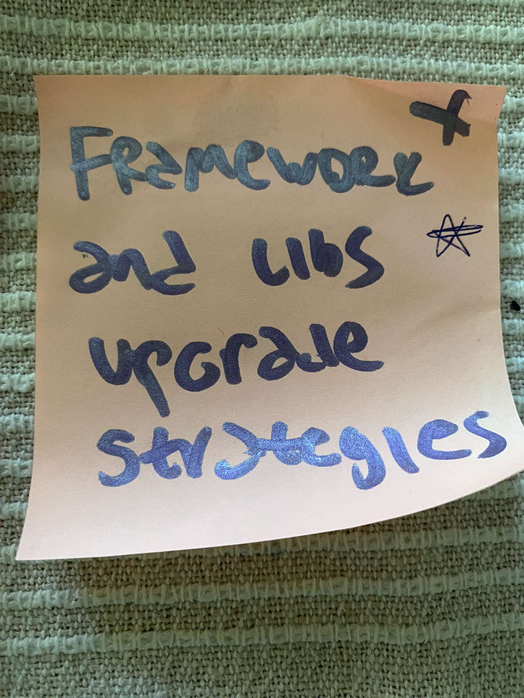
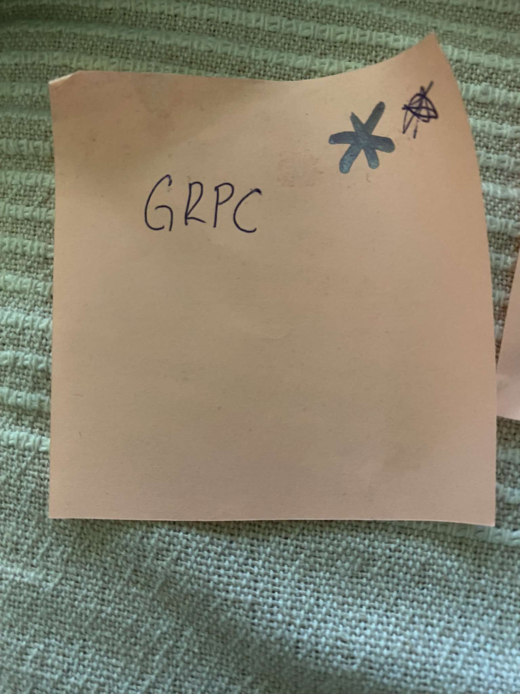
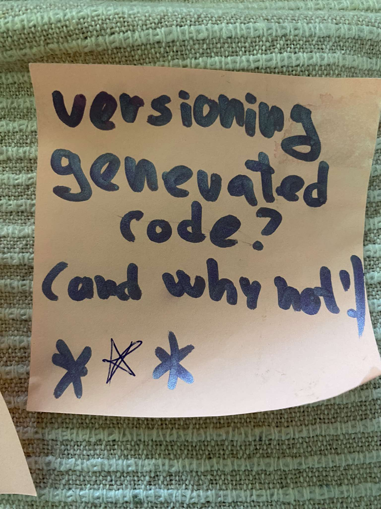
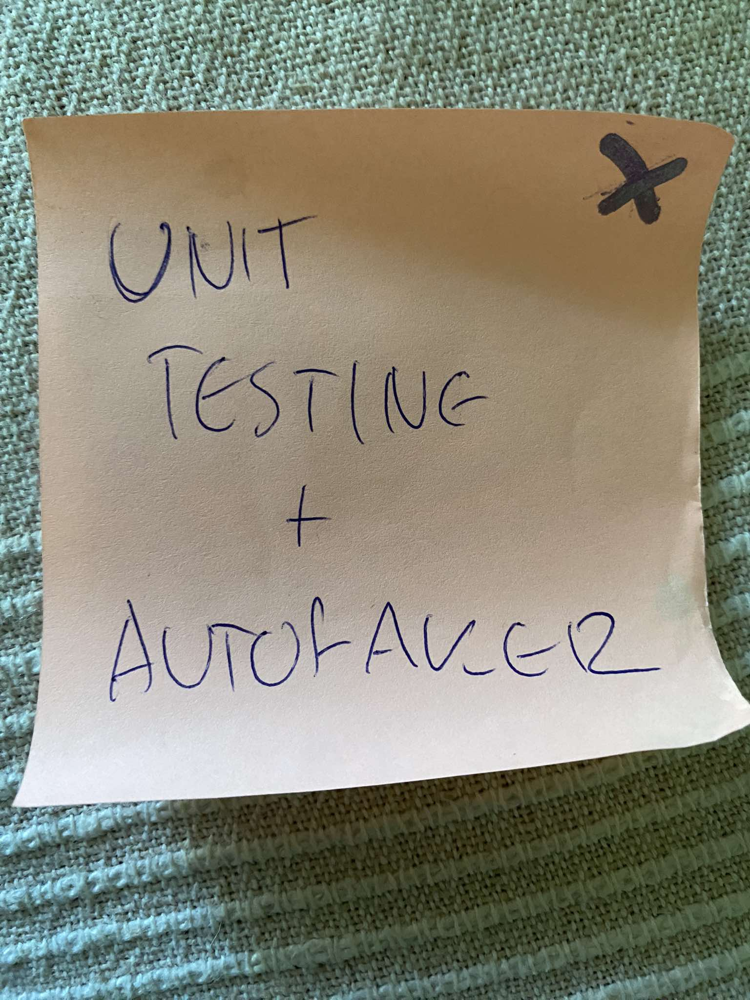
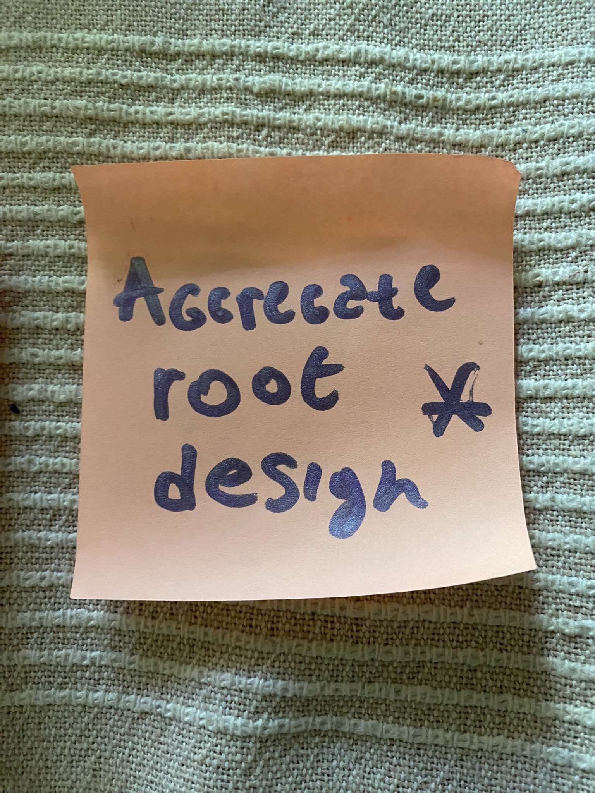

# Meet #3

## Participants
[Aleksa](https://github.com/alexakocic)
[Matija](https://github.com/MatijaMitic)
[Strahinja]

## Location
[Komuna Gastro](http://www.komunagastrobar.rs/)

## Topics

### Frameworks and Libs Upgrade Strategies

We discussed the strategies for upgrading frameworks and libraries in large projects. When should you prioritize upgrading? How do you ensure backward compatibility? We debated the benefits of incrementally upgrading versus waiting for major versions. We also considered the role of automated testing in preventing regressions and discussed tools that can help manage dependencies.

### GRPC

We explored the use of gRPC in microservices architecture, focusing on its benefits over traditional REST APIs, especially in terms of performance and type safety. The discussion included gRPC's integration with ASP.NET Core, the tooling available for generating service definitions, and how to handle versioning. We also considered the potential pitfalls, such as issues with backward compatibility and the learning curve associated with gRPC.

### Versioning Generated Code? (And Why Not)

We debated the pros and cons of versioning generated code. On one side, it was argued that versioning adds traceability and helps in debugging. On the other, it was suggested that it increases the repository size unnecessarily. We explored alternative approaches, such as using CI pipelines to generate code on the fly, and when it might be appropriate to commit generated code despite the drawbacks.

### Unit Testing + AutoFaker

The discussion centered around the importance of effectively mocking data for unit testing in .NET projects. We explored various strategies for creating realistic mock data that closely resembles real-world scenarios, which helps ensure that tests are both robust and meaningful. The focus was on how to balance simplicity with accuracy when setting up mocks, particularly in complex systems with many dependencies. We also covered techniques for managing mock data, ensuring consistency across tests.

### Aggregate Root Design

We dived deep into the principles of designing aggregate roots in Domain-Driven Design (DDD). What makes a good aggregate root? We discussed the implications of aggregate root design on the unit tests philosophy. How to avoid mocking large ammount of unnecessary data? This question followed naturally after the previous Unit Testing topic. The conversation also touched on handling transactions across multiple aggregates and how to keep aggregate roots small and focused.

### Possible topics for the next round

* Collecting Error Logs on FE Clients
* Effective Scrum Rituals
* Picking Right DB When Starting a Project
* Start-Up Frameworks (AppEngine)
* Envoy